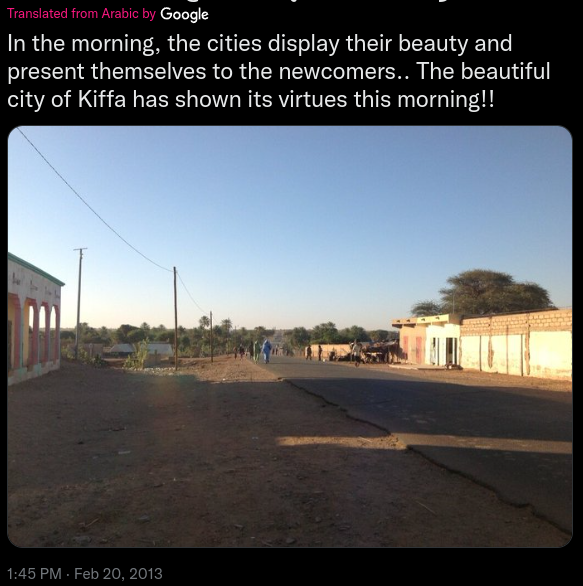
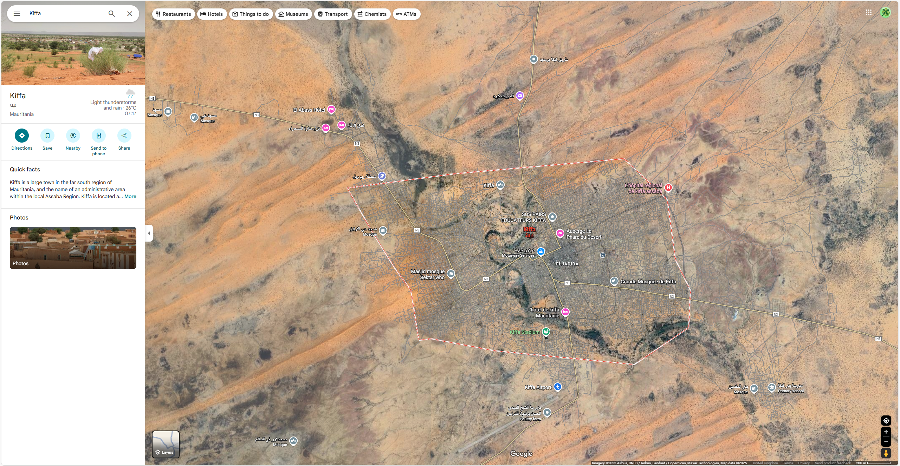

# OSINT Extercise 01

## Task Briefing

Below, a screenshot from a tweet containing a photo can be viewed. Identify the coordinates of where the photo was taken.

## Initial Thoughts
There is a city mentioned **"Kiffa"**, which, Kiffa (Arabic: كيفة) is a large town in the far south region of **Mauritania**.

Another clue is there are buildings and then it becomes much greener - leading to the location being on the outskirts of Kiffa. It also not indicative of a main highway or route out of Kiffa. 

