# OSINT Exercise 029

## Task Brief & Goals
From intelligence given, the photograph was taken on a train ride in the United Kingdom. The photographer always prefers a quiet area where no one can sit behind them, as in a public space, no information is truly private.

The task is to find the following:
1. What the person in front is reading. 
2. Identify the model of train that the photographer is on.
3. Identify the seat number that the photographer is sat at the particular time. 

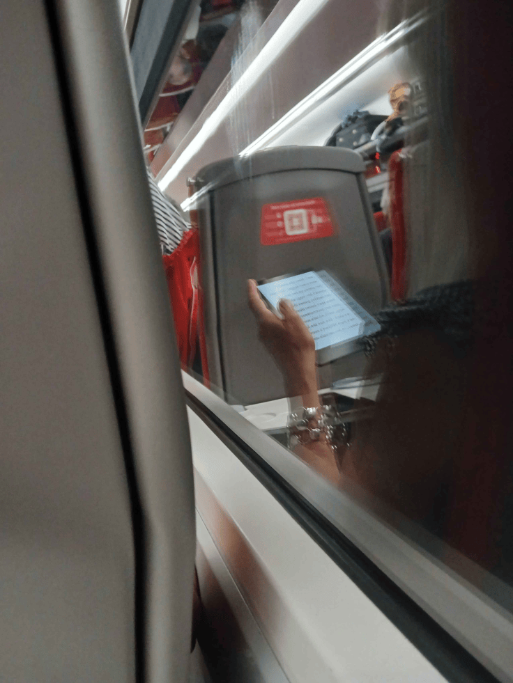

## Initial Thoughts

1. Image will need to be reversed in order to be able to see the words written on the book
2. Train carriage has a locker storage rack overhead
3. Theme of the train is Grey / Red

## Solution - Find the book the person is reading

Since the image needs to be reversed this is our first task, using a software such as [PineTools](https://www.google.co.uk/url?sa=t&rct=j&q=&esrc=s&source=web&cd=&cad=rja&uact=8&ved=2ahUKEwiy5_qF4s2OAxUqVEEAHTvTF68QFnoECBcQAQ&url=https%3A%2F%2Fpinetools.com%2Fflip-image&usg=AOvVaw2DaC8YLYyvn0OobxPhscO_&opi=89978449)
Leaving us with the image below.

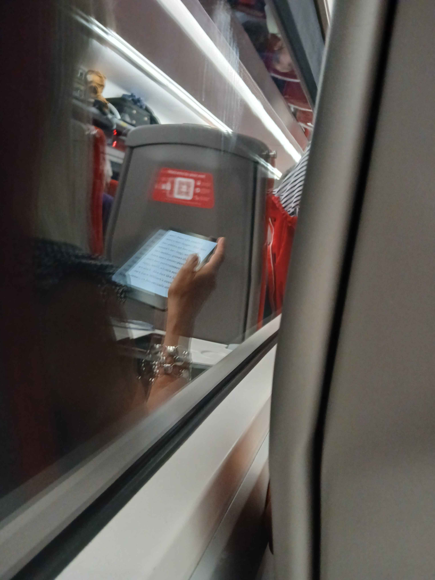

### Zooming in to have a better look at the words, so we can start to find the book the person is reading gives us this image:

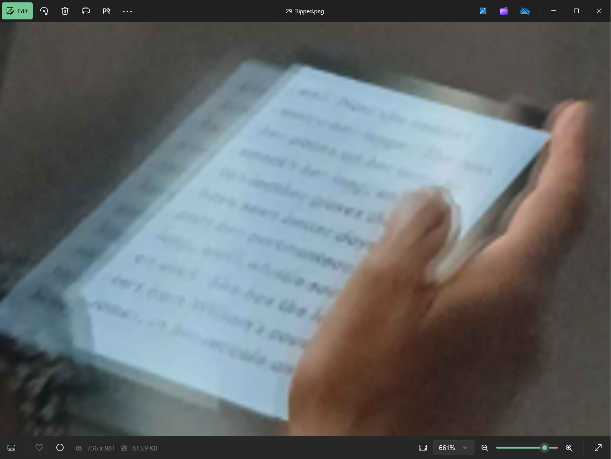

### In order to see better, lowering the exposure and increasing the contrast slightly gives us the image below:

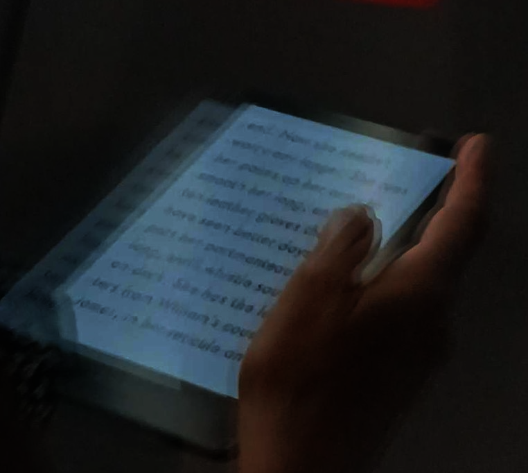

Below is a marked version of what I have been able to pick out:

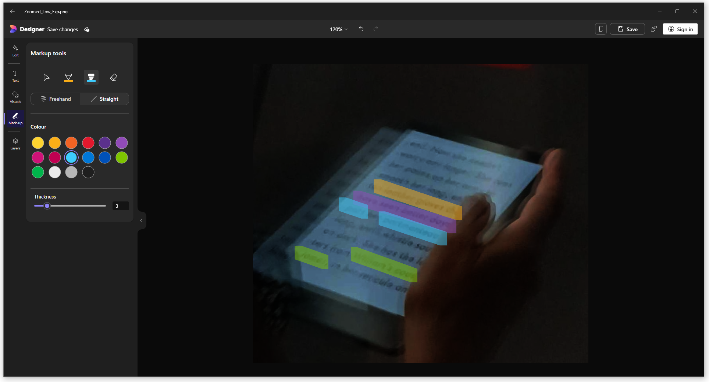

### From this certain words can be extracted these are:

| **Color** | **Description**             |
|-----------|-----------------------------|
| 🟧 **Orange** | **Leather Gloves**          |
| 🟪 **Purple** | **Seen Better Days**        |
| 🟦 **Blue**   | **Boat...??? Portmanteau**      |
| 🟩 **Green**  | **Williams Cousin James**   |

## Going onto google books search and entering in the words that I know, here was the search results:

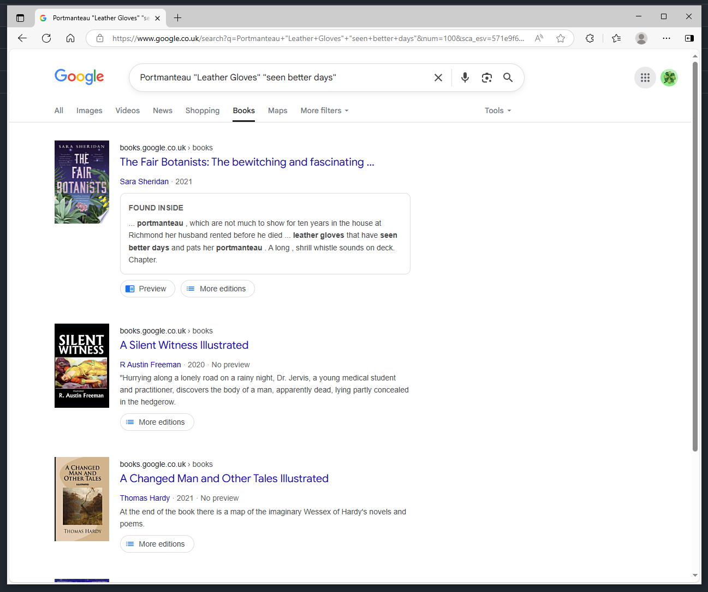

Going into the preview and searching for "leather gloves", the book can be verified as **The Fair Botanists by Sara Sheridan**

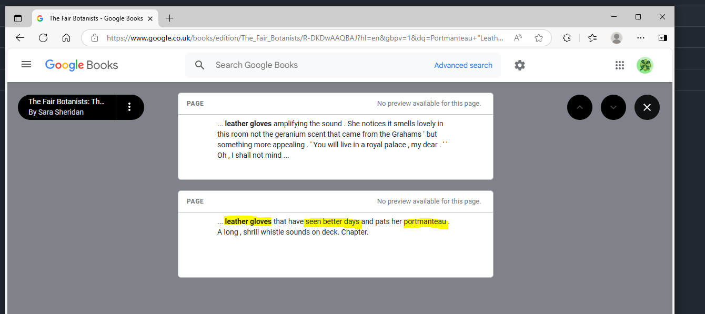

## Solution - Finding the model of train and the seat that they are sat

Linking back to my initial thoughts, specifically **2 and 3**, where the train interior is grey and red with an overhead storage for luggage. There is also a red sticker on the back of at least one of the seats in the carriage. The seats are also red fabric with hard grey backing.

Going to Google and having a google for UK train interiors that are red and grey here is the search results.

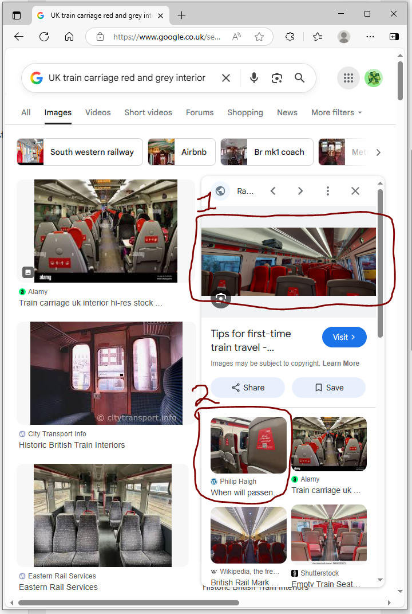

The denotion of image 2 takes us to a high quality image of the seat, so we can see it is the operator LNER (London North Eastern Railway). The featured picture is of Standard Class on a LNER. The back of the seat matches what the inverted task photo depicts (Red fabric and hard grey backing).

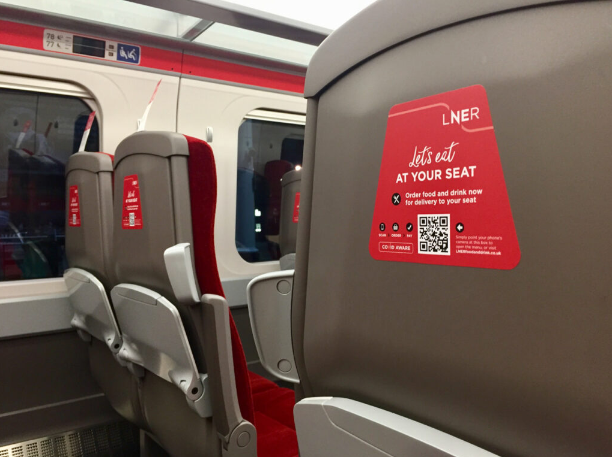

LNER operates along the East Coast of the UK. Map is shown below, or click [HERE](https://assets.ctfassets.net/mxack5k9p2sw/1gXLQ3vbrY5zcWx7bsgQ3g/61856e0c22328de7baf0480303a4f1c8/m_lner2903-lner-route-map-update.pdf).

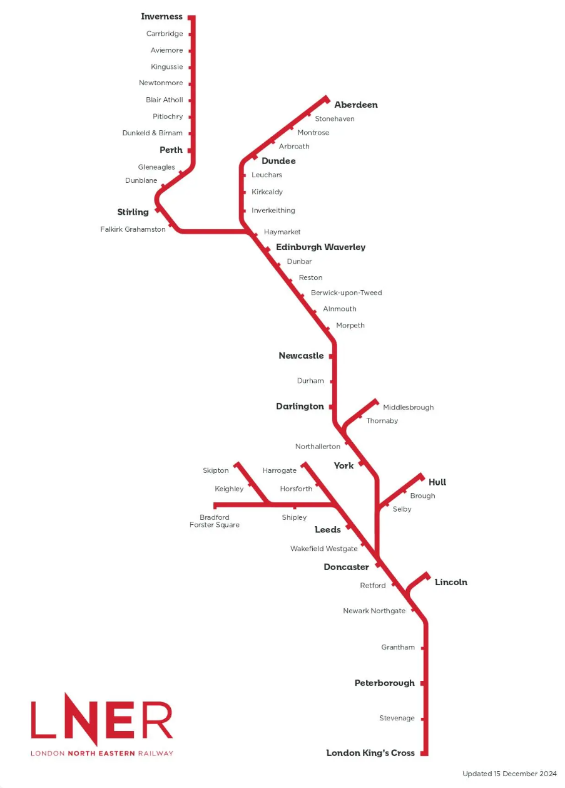

To find the model of train that the eprson is sat on we need to have a look at the current fleet of trains in serivce:

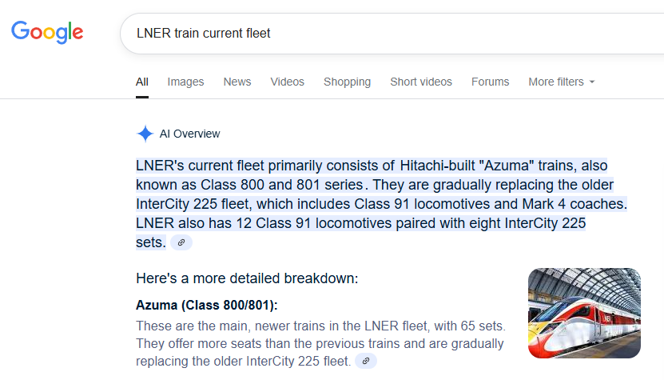

Using Google AI sources of information, it can be shown that the vast majority of the fleet consists of the Hitachi Built "Azuma" Trains also known as the class 800 and 801 series. 

Looking into both of these series on Wikipedia, here are the results for the 800 Series:

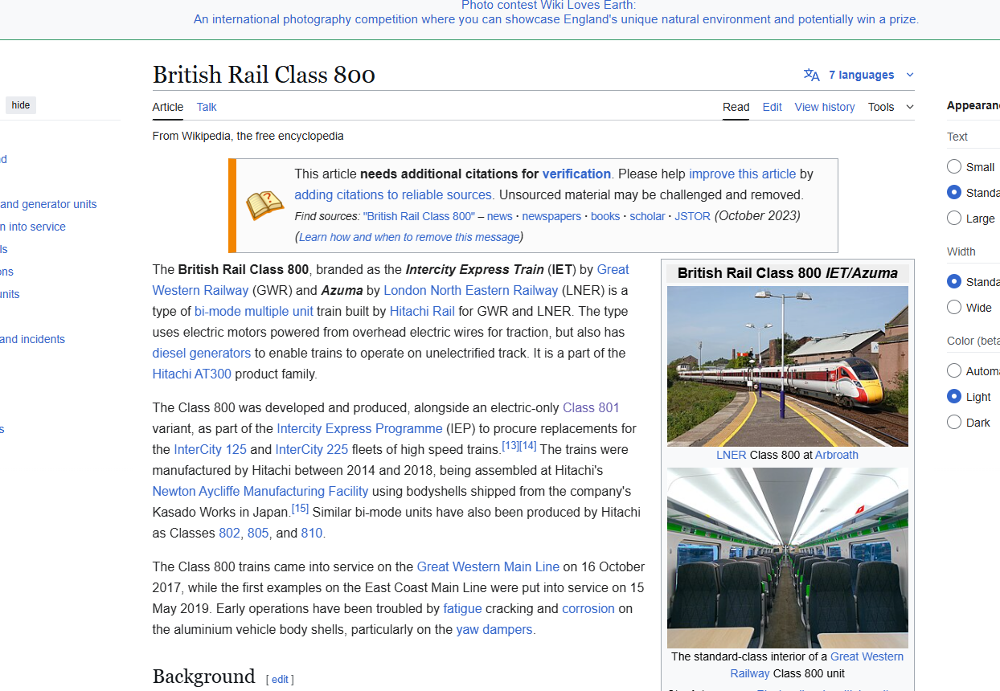

Results for the 801 Series:
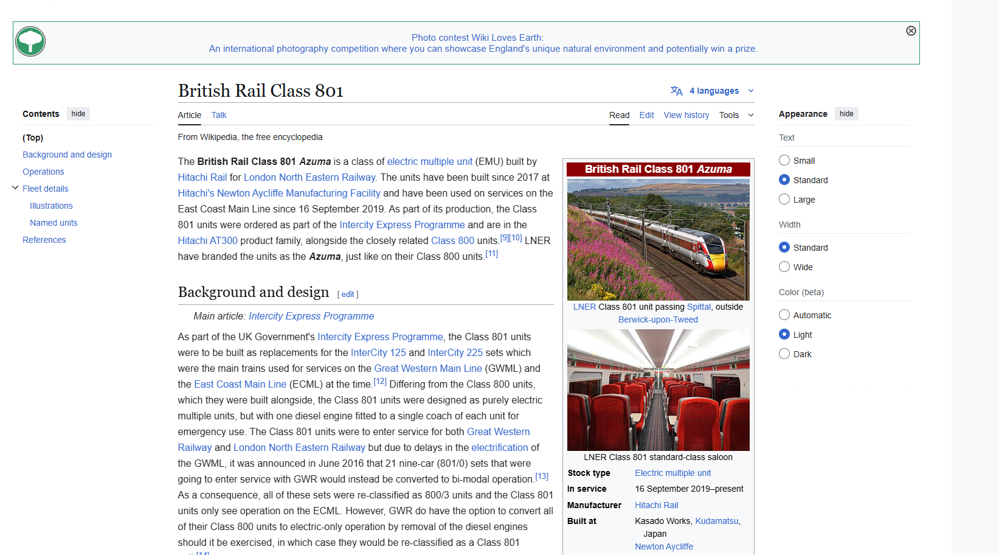

**It can be seen that out of the two fleet options the one that matches the initial photograph is the 801 Series**

## Solution - What seat is the photographer sat on

According to LNER’s guide, class 801 comes in either 9 or 5 carriages, and the 5 carriage sets will always be doubled up to 10. [HERE](https://sites.create-cdn.net/sitefiles/19/3/4/193478/Azuma-seat-maps.pdf). According to the website "The LNER Azuma trains have a designated "Quiet Coach" in Coach H on the 9-coach trains. If you are traveling in this coach, it is requested that you keep noise to a minimum and silence electronic devices. There is no dedicated quiet coach on the 5 and 10-coach Azuma trains."

Knowing that the photographer always prefers "quiet areas where no one can sit behind me"

Looking at the 9 car train, in coach H (Quiet zone) which is pictured below:

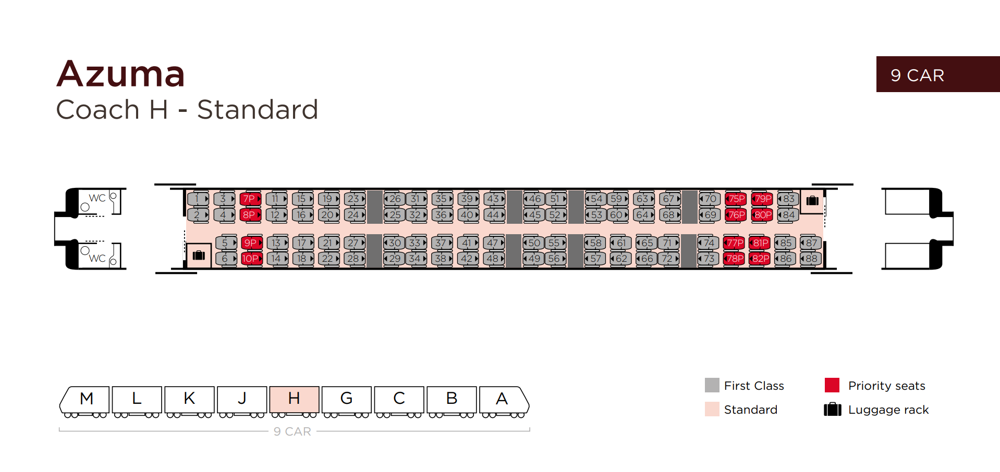

Knowing that the phorographer likes no-one to sit behind them, and that they are on the **right** side of the carriage, it can be assumed that they would be sitting in Seat 83 on Coach H on board of the 801 Azuma Series trains operated by LNER
